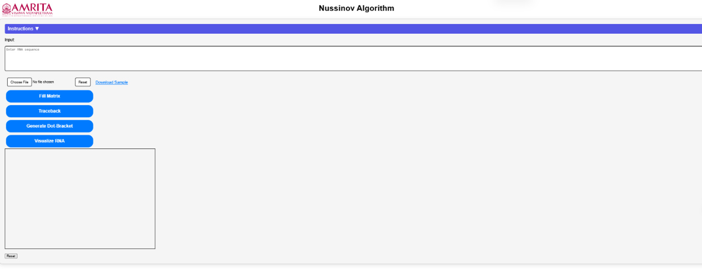
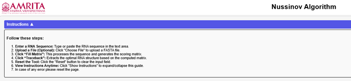
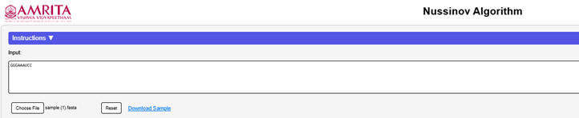
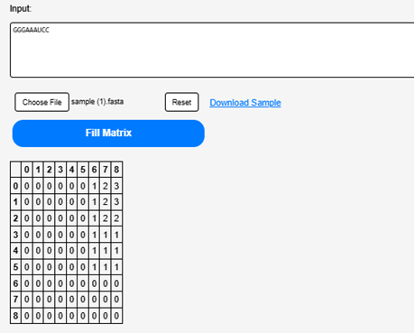
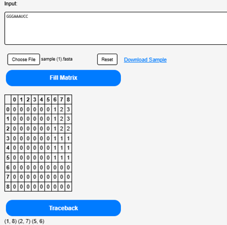
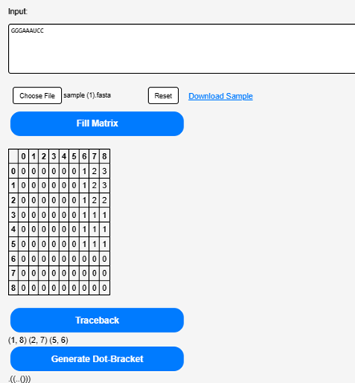
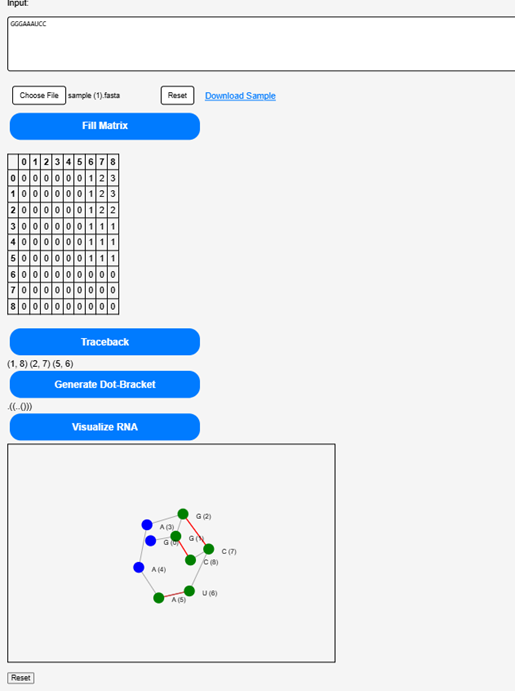
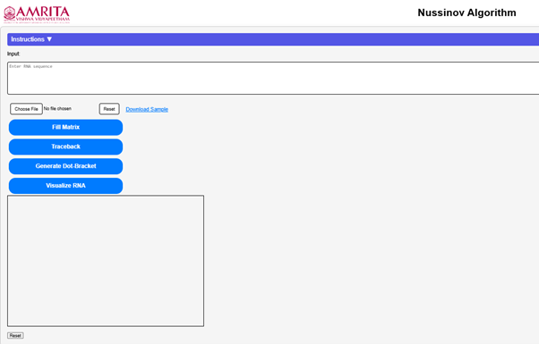

### Procedure

#### Step 1.
Open the simulator tab where user can find a user-friendly interface with different options to run the experiment. 

&nbsp;

#### Step 2.
Click on the "Instruction" button. Read through the guidelines to understand how the simulator works before proceeding. 

&nbsp;

#### Step 3.
User can manually enter an RNA sequence into the input box. Alternatively, download a sample RNA file (. fasta format) from the page and upload it using the “Choose File” button. 

&nbsp;

#### Step 4.
Click on the “Fill the matrix” button to calculate the possible base pairs within RNA sequence

&nbsp;

#### Step 5.
Click on the “Traceback” button to determine the possible secondary structures of uploaded RNA sequence.

&nbsp;

#### Step 6.
Click on the “Generate Dot-Bracket” to obtain a representation of the most stable RNA secondary structure.

&nbsp;

#### Step 7.
Click on the “Visualize RNA” to see a graphical representation of the most stable RNA structure.

&nbsp;

#### Step 8.
User can repeat the experiment, click on the “Reset” button to clear the current data and start again.

&nbsp;

